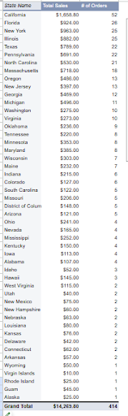
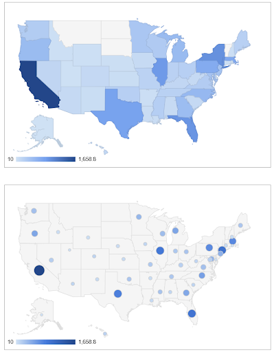

# Reseller Sales by State – Data Cleaning & Visualization Project

This project explores regional sales trends from my personal reselling business by cleaning and analyzing customer location data using Google Sheets.

##  Goal

Identify which U.S. states generate the most sales, and visualize that information using pivot tables and geographic mapping.

##  Tools Used

- **Google Sheets**: for data cleaning, pivot tables, and mapping
- **Excel functions**: including `VLOOKUP`, string functions, and pivot tools
- **Data cleaning techniques**: standardizing state abbreviations to full names

##  Data Cleaning

The original dataset included U.S. state abbreviations that were not compatible with map chart features. I created a reference table and used `VLOOKUP` to convert abbreviations (e.g., "MA") to full state names ("Massachusetts") for geographic mapping.

##  Analysis & Visuals

- Created a **pivot table** to count total orders by state
- Built a **map chart** to display which states had the highest number of orders
- Used conditional formatting and chart styles to highlight trends

## Key Insights

- Top-performing states included California, Florida, New York, Illinois
- A large percentage of orders came from states in the Northeast
- Geographic visualizations helped clarify where my strongest customer base is

## 🔗 View the Google Sheet

[Click to view the project sheet](https://your-google-sheet-link-here)

---

## Files Included

- `sales_cleaned.csv` – (optional) Clean version of dataset
- `pivot-chart.png` – Graph of sales by state
- `map-visual.png` – Map chart showing geographic trends

---

## Next Steps

- Add monthly or product-category trends
- Automate state conversion with Python or R
- Explore demographic overlays if zip codes become available
